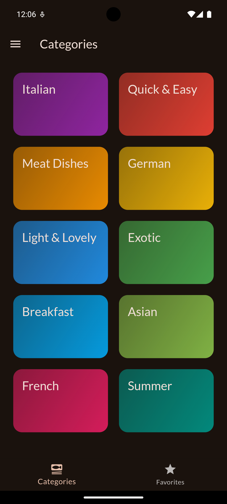
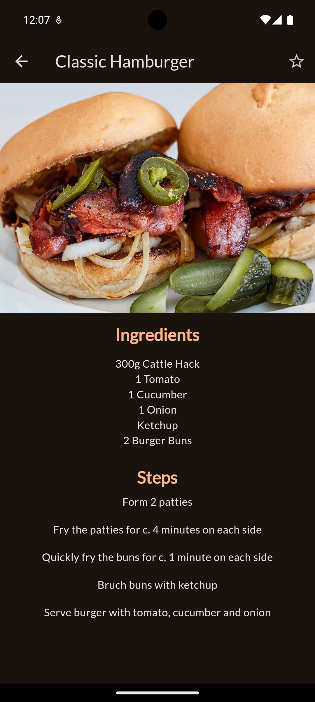

# Meals App (Yemek Uygulaması)

**Turkish (Türkçe)**

## Proje Açıklaması

Bu Flutter uygulaması, kullanıcıların çeşitli yemek tariflerini keşfetmesine ve kategorilere göre filtreleyerek tarifleri görüntülemesine olanak tanır. Kullanıcılar favori yemek tariflerini kaydedebilir ve filtre ayarları yaparak belirli yemek türlerini görüntüleyebilir.

## Özellikler

- Farklı kategorilere göre yemek tarifleri görüntüleme
- Yemek tariflerinin detaylarını inceleme
- Favorilere yemek ekleyebilme
- Filtreleme seçenekleri ile belirli yemek türlerini seçebilme
- Kullanıcı dostu arayüz

## Ekran Görüntüleri

Aşağıda uygulamadan bazı ekran görüntülerini bulabilirsiniz:


*Yemek kategorileri ekranı*


*Yemek ekranı görüntüsü*


*Yemek tarifi detayı ekranı*


*Favoriler ekranı*


*Filtre ekranı görüntüsü*

## Kurulum

1. Kodu bilgisayarınıza indirin:

    ```bash
    git clone https://github.com/YenerCenger/Meals-App.git
    cd Meals-App
    ```

2. Gerekli bağımlılıkları yükleyin:

    ```bash
    flutter pub get
    ```

3. Uygulamayı çalıştırın:

    ```bash
    flutter run
    ```

## Kullanım

1. Uygulama açıldığında yemek kategorilerini göreceksiniz.
2. Bir kategoriye tıklayarak o kategoriye ait yemek tariflerini görüntüleyebilirsiniz.
3. Bir yemeğe tıklayarak tarifi detaylı inceleyebilir ve favorilere ekleyebilirsiniz.
4. Uygulamanın üst kısmındaki ayarlar menüsünden filtreleme seçeneklerine ulaşabilirsiniz.

## Dikkat Edilmesi Gerekenler

- Uygulama, kullanıcıların yemek tariflerini kategorilere göre filtrelemesine olanak tanır.
- Favorilere eklenen tariflere kolayca erişebilirsiniz.

## Katkıda Bulunma

Eğer bu projeye katkıda bulunmak istiyorsanız, lütfen bir çekme isteği (pull request) açın. Büyük değişiklikler yapmadan önce, lütfen tartışma bölümünde konuyu açın.

## Lisans

Bu proje [MIT Lisansı](LICENSE) altında lisanslanmıştır. Daha fazla bilgi için [LİSANS DOSYASI](LICENSE) dosyasını inceleyin.

---

**English**

## Project Description

This Flutter application allows users to discover various meal recipes and view them by categories. Users can save their favorite recipes and apply filters to display specific types of meals.

## Features

- View meal recipes by different categories
- Explore meal details
- Add meals to favorites
- Filter meals based on specific preferences
- User-friendly interface

## Screenshots

Below are some screenshots from the app:


*Categories Screen*


*Meals Screen*


*Meal Details Screen*


*Favorites Screen*


*Filters Screen*

## Installation

1. Clone the code to your computer:

    ```bash
    git clone https://github.com/YenerCenger/Meals-App.git
    cd Meals-App
    ```

2. Install the required dependencies:

    ```bash
    flutter pub get
    ```

3. Run the app:

    ```bash
    flutter run
    ```

## Usage

1. When you open the app, you will see meal categories.
2. Click on a category to view the meals within that category.
3. Click on a meal to explore its details and add it to your favorites.
4. Access filtering options from the settings menu at the top of the app.

## Notes

- The app allows users to filter meal recipes by categories.
- You can easily access your favorite recipes.

## Contributing

If you want to contribute to this project, please open a pull request. Before making significant changes, please open a discussion in the Issues section.

## License

This project is licensed under the [MIT License](LICENSE). For more information, see the [LICENSE](LICENSE) file.
